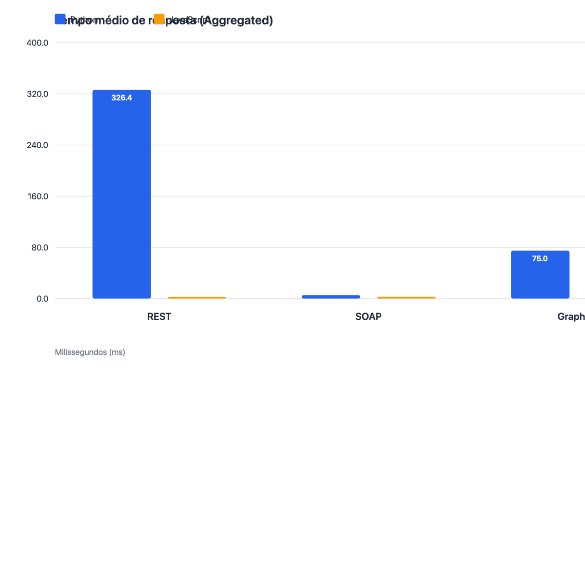
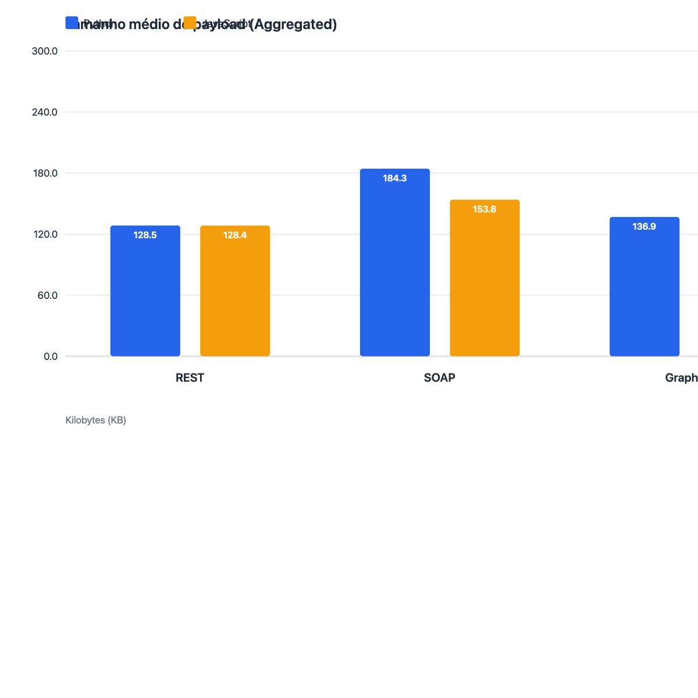

# Serviço de Streaming de Músicas — REST, SOAP e GraphQL

Comparação de **REST**, **SOAP** e **GraphQL** implementados em **Python** e **JavaScript**, com testes de carga via Locust.

## Objetivo

Comparar tecnologias de invocação de serviços remotos em termos de performance, usabilidade e características técnicas.

## Recursos

Gerenciamento de **usuários**, **músicas** e **playlists** (relação N:N entre playlists e músicas). Dados de teste são populados automaticamente via seed ao iniciar cada serviço.

## Estrutura

```
integracoes-python-javascript/
├── rest/          # FastAPI (Python) e Express (JavaScript)
├── soap/          # Spyne (Python) e node-soap (JavaScript)
├── graphql/       # Strawberry (Python) e Apollo (JavaScript)
├── locust/        # Scripts de teste de carga
├── scripts/       # Scripts para subir servidor + Locust
├── results/       # Resultados dos testes
└── docs/          # Documentação detalhada
```

## Pré-requisitos

- Python 3.9+
- Node.js 14+
- Locust: `pip3 install locust`
- Docker (opcional)

## Portas dos serviços

| Serviço | Linguagem | Porta | URL |
|---------|-----------|-------|-----|
| REST | Python | 8000 | http://localhost:8000/api/v1 |
| REST | JavaScript | 3001 | http://localhost:3001/api/v1 |
| SOAP | Python | 8001 | http://localhost:8001/soap |
| SOAP | JavaScript | 3002 | http://localhost:3002/soap |
| GraphQL | Python | 8002 | http://localhost:8002/graphql |
| GraphQL | JavaScript | 3003 | http://localhost:3003/graphql |

## Executar testes (recomendado)

Os scripts em `scripts/` instalam dependências, sobem o servidor correspondente e executam o Locust. Execute a partir da **raiz do repositório**:

```bash
# REST
bash scripts/run_rest_python.sh
bash scripts/run_rest_javascript.sh

# SOAP
bash scripts/run_soap_python.sh
bash scripts/run_soap_javascript.sh

# GraphQL
bash scripts/run_graphql_python.sh
bash scripts/run_graphql_javascript.sh
```

Cada script:

1. Verifica se o Locust está instalado
2. Libera a porta do serviço, se estiver em uso
3. Instala dependências do servidor
4. Sobe o servidor em background
5. Executa o Locust (100 usuários, spawn rate 20)
6. Salva resultados CSV em `{rest|soap|graphql}/results/`

Abra http://localhost:8089 para a interface web do Locust durante a execução.

## Subir um serviço manualmente

```bash
# REST Python
cd rest/python-fastapi-rest && pip3 install -r requirements.txt && uvicorn app:app --port 8000

# REST JavaScript
cd rest/javascript-express-rest && npm install && npm start

# SOAP Python
cd soap/python-spyne-soap && pip3 install -r requirements.txt && python3 app.py

# SOAP JavaScript
cd soap/javascript-node-soap && npm install && npm start

# GraphQL Python
cd graphql/python-strawberry-graphql && pip3 install -r requirements.txt && uvicorn app:app --port 8002

# GraphQL JavaScript
cd graphql/javascript-apollo-graphql && npm install && npm start
```

Para testar manualmente com Locust (em outro terminal, na raiz do projeto):

```bash
locust -f locust/rest_python_locust.py --host http://localhost:8000
```

Substitua o arquivo e a porta conforme o serviço. Veja [docs/como-executar.md](docs/como-executar.md) para o passo a passo completo.

## Docker

```bash
docker-compose up -d    # subir todos os serviços
docker-compose down     # parar
```

## Exemplos rápidos

**GraphQL** — query no playground (`/graphql`):

```graphql
query { users { id name email } }
```

**REST** — listar usuários:

```bash
curl http://localhost:8000/api/v1/users
```

**Seed** (popular banco):

```bash
curl -X POST http://localhost:8000/api/v1/seed          # REST
# GraphQL: mutation { seed }
```

## Comparação resumida

| Critério | REST | SOAP | GraphQL |
|----------|------|------|---------|
| Complexidade | Baixa | Alta | Média |
| Verbosidade | Média | Muito alta | Baixa |
| Ideal para | APIs simples | Integração corporativa | Apps modernas |

## Resultados dos testes de carga

Métricas extraídas dos arquivos `*_stats.csv` gerados pelo Locust (100 usuários, spawn rate 20). Valores da linha **Aggregated** de cada teste.

### Comparativo geral

| Tecnologia | Linguagem | Requisições | Tempo médio (ms) | Tempo mediano (ms) | Tamanho médio da resposta | Throughput (req/s) | Falhas |
|------------|-----------|-------------|------------------|--------------------|---------------------------|--------------------|--------|
| REST | Python | 1.555 | 326,4 | 290 | 131,6 KB | 44,0 | 0 |
| REST | JavaScript | 4.678 | 2,7 | 2 | 131,5 KB | 149,6 | 0 |
| SOAP | Python | 9.157 | 5,5 | 4 | 188,7 KB | 152,7 | 0 |
| SOAP | JavaScript | 9.168 | 2,9 | 3 | 157,5 KB | 152,8 | 0 |
| GraphQL | Python | 5.971 | 75,0 | 70 | 140,2 KB | 99,5 | 0 |
| GraphQL | JavaScript | 8.720 | 8,8 | 7 | 131,5 KB | 145,3 | 0 |

### Gráficos comparativos

Valores da linha **Aggregated** de cada teste. Azul = Python, laranja = JavaScript.

#### Tempo de resposta

Comparativo do tempo médio de resposta (ms) entre REST, SOAP e GraphQL.

<p align="center">
  
</p>

#### Tamanho do payload

Comparativo do tamanho médio da resposta (KB) — média ponderada dos endpoints `musics`, `playlists` e `users`.

<p align="center">
  
</p>

#### Throughput (req/s)

Comparativo de requisições processadas por segundo.

<p align="center">
  
</p>

Arquivos fonte (SVG): `docs/charts/response_time.svg`, `docs/charts/payload_size.svg`, `docs/charts/throughput.svg`.

Para regenerar os gráficos após novos testes:

```bash
python3 scripts/generate_benchmark_charts.py
```

### Comparativo por tecnologia (Python)

| Métrica | REST | SOAP | GraphQL |
|---------|------|------|---------|
| Requisições | 1.555 | 9.157 | 5.971 |
| Tempo médio | 326,4 ms | 5,5 ms | 75,0 ms |
| Tempo mediano | 290 ms | 4 ms | 70 ms |
| Tamanho médio da resposta | 131,6 KB | 188,7 KB | 140,2 KB |
| Throughput | 44,0 req/s | 152,7 req/s | 99,5 req/s |

### Comparativo por tecnologia (JavaScript)

| Métrica | REST | SOAP | GraphQL |
|---------|------|------|---------|
| Requisições | 4.678 | 9.168 | 8.720 |
| Tempo médio | 2,7 ms | 2,9 ms | 8,8 ms |
| Tempo mediano | 2 ms | 3 ms | 7 ms |
| Tamanho médio da resposta | 131,5 KB | 157,5 KB | 131,5 KB |
| Throughput | 149,6 req/s | 152,8 req/s | 145,3 req/s |

### Tamanho do payload por endpoint

As tabelas acima usam a linha **Aggregated** do Locust: média ponderada dos três endpoints, com pesos 3:2:1 (`musics` / `playlists` / `users`) no script Locust. Para comparar verbosidade de protocolo, o mesmo recurso deve ser analisado isoladamente — em geral `musics`, o maior payload.

| Endpoint | REST Python | REST JS | SOAP Python | SOAP JS | GraphQL Python | GraphQL JS |
|----------|-------------|---------|-------------|---------|----------------|------------|
| musics | 168,5 KB | 168,5 KB | **247,7 KB** | **204,7 KB** | 178,5 KB | 168,5 KB |
| playlists | 113,0 KB | 113,0 KB | **151,3 KB** | **132,1 KB** | 117,8 KB | 113,0 KB |
| users | 60,7 KB | 60,7 KB | **84,0 KB** | **69,5 KB** | 63,9 KB | 60,7 KB |
| **Aggregated** | 131,6 KB | 131,5 KB | **188,7 KB** | **157,5 KB** | 140,2 KB | 131,5 KB |

SOAP é o protocolo com maior payload em todos os endpoints e linguagens. REST e GraphQL JavaScript ficam praticamente iguais; GraphQL Python fica um pouco acima por causa do envelope JSON (`{"data":{"musics":[...]}}`). SOAP Python é maior que SOAP JavaScript porque cada tag XML usa o prefixo `tns:` (ex.: `<tns:id>` vs `<id>`).

### Principais observações

- **Tamanho da mensagem:** SOAP é o maior em cada endpoint (ver tabela acima); no agregado, SOAP Python (~189 KB) lidera, seguido de GraphQL Python (~140 KB) e REST/GraphQL JavaScript (~132 KB).
- **Tempo de resposta (Python):** REST Python apresentou o maior tempo médio (~326 ms); GraphQL (~75 ms) e SOAP (~5,5 ms) foram significativamente mais rápidos no mesmo cenário.
- **Tempo de resposta (JavaScript):** REST (~2,7 ms), SOAP (~2,9 ms) e GraphQL (~8,8 ms) mantiveram tempos baixos, com throughput entre 145 e 153 req/s.
- **Volume de requisições:** Entre as implementações JavaScript, SOAP liderou em volume (9.168 requisições); entre as Python, SOAP também liderou (9.157 requisições).
- **Confiabilidade:** Todas as implementações concluíram os testes sem falhas.

### Por que os tempos não estão "como deveriam"?

Em teoria, esperaríamos que **REST** fosse o protocolo mais rápido (menos camadas), **SOAP** o mais lento (XML verboso) e que **Python e JavaScript** tiverem desempenho parecido quando fazem a mesma operação. Os resultados mostram o oposto em vários casos — REST Python com ~326 ms de média, SOAP Python com ~5 ms, JavaScript com ~2–9 ms em todos os protocolos. Isso não indica que os protocolos "estão errados", mas que os números refletem **limitações do cenário de teste** e **diferenças de implementação**, não apenas a tecnologia de integração.

#### 1. Metodologia de teste não padronizada

Os scripts em `scripts/` executam o Locust **sem duração fixa** (`--headless` e `--run-time` não são usados). O teste começa e termina manualmente na interface web (http://localhost:8089). Isso gera discrepâncias diretas:

| Implementação | Requisições | Throughput (req/s) | Duração estimada do teste |
|---------------|-------------|--------------------|---------------------------|
| REST Python | 1.555 | 44,0 | ~35 s |
| REST JavaScript | 4.678 | 149,6 | ~31 s |
| SOAP / GraphQL (demais) | 5.971–9.168 | 99–153 | ~40–60 s |

Ou seja, **não todos os testes rodaram pelo mesmo tempo**. Comparar volume total de requisições ou throughput entre arquivos CSV diferentes é parcialmente enganoso: um teste mais longo naturalmente acumula mais requisições.

#### 2. Python vs JavaScript — stacks diferentes, não só linguagem

As implementações JavaScript usam **better-sqlite3** com uma conexão persistente ao banco, statements preparados e serialização JSON nativa do V8:

```javascript
// rest/javascript-express-rest/app.js
const db = new Database('./rest_javascript.db');
res.json(db.prepare('SELECT * FROM musics').all());
```

As implementações Python usam **SQLAlchemy ORM** com sessão por requisição, conversão manual de linhas em dicionários Python e serialização JSON via FastAPI:

```python
# rest/python-fastapi-rest/app.py
with Session(engine) as session:
    return [{"id": r.id, "title": r.title, ...} for r in session.query(MusicRow).all()]
```

O Node.js mantém uma conexão SQLite aberta e opera com bindings nativos; o Python cria objetos ORM, monta listas de dicts e serializa ~130 KB de JSON em cada resposta. Essa diferença de stack explica a lacuna de **~2 ms (JS) vs ~326 ms (REST Python)** — muito maior que a diferença entre protocolos.

#### 3. Saturação sob carga — o tempo medido inclui fila de espera

Todos os testes usam **100 usuários virtuais** com spawn rate 20, mas os servidores Python sobem com **um único processo**:

```bash
python3 app.py   # uvicorn.run() ou HTTPServer — 1 worker
```

Com rotas síncronas, FastAPI/uvicorn delega a um pool de threads (limitado). Com 100 usuários simultâneos e respostas de ~130 KB, o servidor **satura** e as requisições passam a esperar na fila. O Locust mede o tempo **total da requisição** (fila + processamento + transferência), não só o processamento isolado.

Isso é visível no REST Python: throughput de apenas **44 req/s** com mediana de **290 ms**, enquanto as stacks JavaScript sustentam **~150 req/s** com mediana de **2–7 ms**. O REST Python não é 100× mais lento para processar uma requisição individual em isolamento — ele **não consegue atender a carga** e a fila infla os tempos.

#### 4. REST Python mais lento que GraphQL e SOAP (Python) — anomalia aparente

Na mesma linguagem, REST deveria ser o mais simples. Os números mostram:

| Python | Tempo médio | Throughput |
|--------|-------------|------------|
| REST | 326,4 ms | 44,0 req/s |
| GraphQL | 75,0 ms | 99,5 req/s |
| SOAP | 5,5 ms | 152,7 req/s |

Possíveis causas dessa ordem invertida:

- **REST Python foi o mais saturado** no teste (menor throughput → maior fila → maior latência mediana).
- **Payload pesado no endpoint mais chamado:** `/musics` tem peso 3 no Locust e responde ~168 KB; no CSV do REST Python, sua mediana chega a **500 ms**.
- **SOAP Python** concatena strings XML com f-strings (sem camada ORM→dict→JSON), o que, neste volume de dados, pode ser mais barato que a pipeline do FastAPI.
- **GraphQL Python** usa o mesmo SQLAlchemy, mas o teste pode ter rodado em condições de carga menos extremas (menos fila acumulada).

Isso mostra que, neste projeto, os tempos medem **a stack completa sob carga**, não o protocolo isolado.

#### 5. Tamanho da resposta impacta todos, mas SOAP não é o mais lento

SOAP produz o maior payload (~189 KB em Python), mas mantém tempos baixos porque a implementação JavaScript é eficiente e o teste SOAP Python não atingiu o mesmo nível de saturação que o REST Python. O tamanho da mensagem afeta serialização e transferência, mas **runtime + concorrência** dominam os resultados.

#### Resumo: o que os números realmente comparam

| O que parece ser comparado | O que está sendo medido de fato |
|----------------------------|--------------------------------|
| REST vs SOAP vs GraphQL | Framework + ORM + runtime + configuração de deploy |
| Python vs JavaScript | SQLAlchemy + uvicorn 1 worker vs better-sqlite3 + Node.js |
| Tempo de resposta do protocolo | Tempo total sob fila com 100 usuários simultâneos |
| Volume de requisições | Duração manual variável de cada execução do Locust |

Para comparações mais coerentes entre protocolos e linguagens, seria necessário padronizar: mesma duração de teste (`--headless --run-time 60s`), mesma estratégia de acesso ao banco, e servidores Python com múltiplos workers (`uvicorn --workers 4`). Os resultados atuais são válidos como **observação do cenário real de execução do projeto**, mas não como benchmark isolado de protocolo.

Arquivos de origem: `rest/results/`, `soap/results/` e `graphql/results/`.

## Documentação

- [Como executar](docs/como-executar.md) — guia detalhado de execução
- [Arquitetura](docs/arquitetura.md)
- [Endpoints](docs/endpoints.md)
- [Relatório de testes](docs/relatorio-testes.md)

## Status

| Componente | Status |
|-----------|--------|
| REST / SOAP / GraphQL (Python e JS) | Completo |
| Testes Locust | Completo |
| Docker | Funcional |

---

## Equipe

- **Diego Antonioli** — 
- **Victor Soares** - 1410777

---

