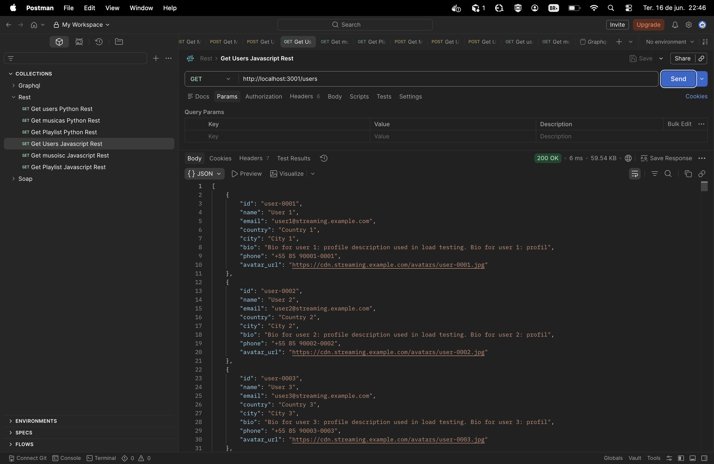
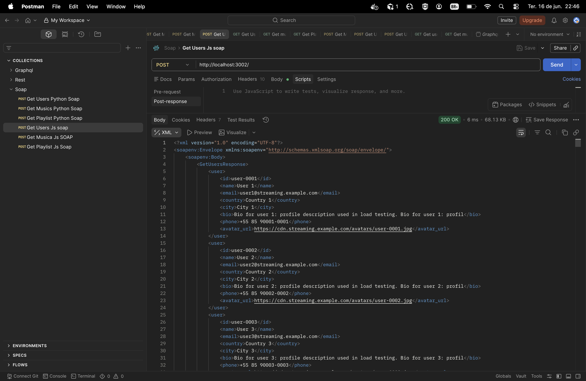
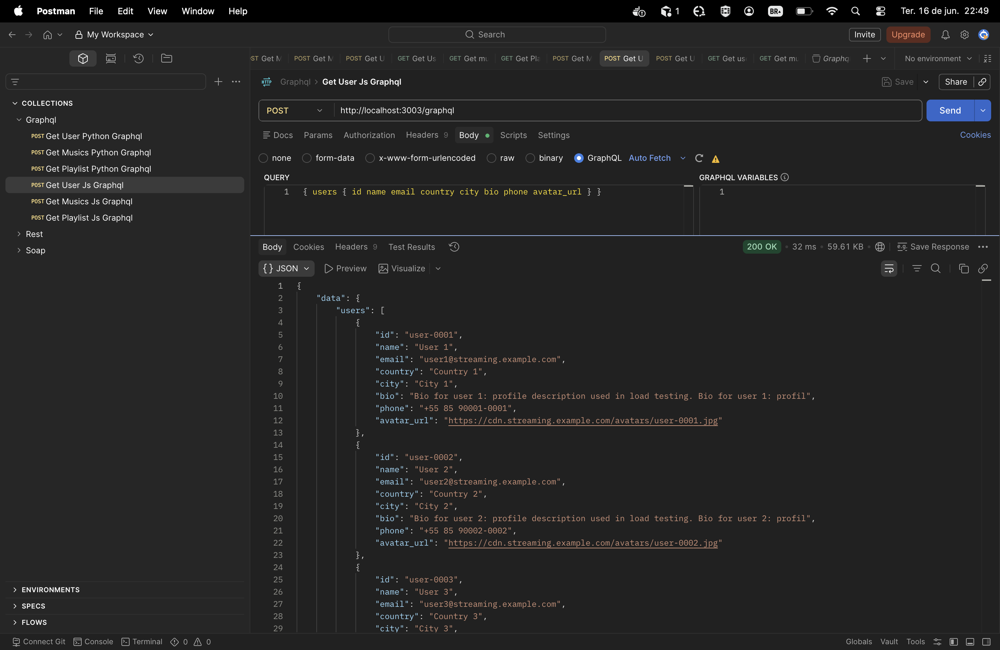

# Serviço de Streaming de Músicas — REST, SOAP e GraphQL

Comparação de **REST**, **SOAP** e **GraphQL** implementados em **Python** e **JavaScript**, com testes de carga via Locust.

## Atualizações desde a última apresentação

Desde a apresentação anterior, foram concluídos os seguintes pontos:

1. **Correção das integrações com JavaScript** — REST (Express), SOAP (node-soap) e GraphQL (Apollo) foram ajustados e validados. As evidências de funcionamento estão na seção [Integrações JavaScript](#integrações-javascript), com capturas de tela do Postman (`docs/imgs/`).
2. **Criação dos gráficos comparativos** — gráficos de tempo de resposta, tamanho do payload e throughput foram gerados a partir dos resultados do Locust. Veja a seção [Gráficos comparativos](#gráficos-comparativos) (`docs/charts/`).
3. **Padronização das integrações para testes justos** — Python passou a usar `sqlite3` puro (conexão persistente, queries diretas), alinhado ao `better-sqlite3` do JavaScript; SOAP Python usa `ThreadingHTTPServer`; payload SOAP unificado (`tns:`/`tns:item`) em ambas as linguagens; Locust roda em modo headless com duração fixa de 60 s em todos os scripts.
4. **Correção do REST Python** — rotas `def` convertidas para `async def` + serialização via `json.dumps` + `Response` direta. Elimina o overhead do `ThreadPoolExecutor` e do `jsonable_encoder` do FastAPI, trazendo o REST Python para a ordem teórica correta: REST (3,5 ms) < GraphQL (52 ms) < SOAP (181 ms).
5. **Correção das integrações JavaScript** — prepared statements movidos para o nível de módulo (compilados uma vez no startup, reutilizados em cada request); SOAP JS tinha três middlewares `express.text()` registrados (dois deles redundantes), consolidados em um único; REST JS usa `JSON.stringify` + `res.type('json').send()` diretamente em vez de `res.json()`. SOAP JS melhorou de 3,3 ms para 3,0 ms; GraphQL JS de 8,5 ms para 8,1 ms.

## Objetivo

Comparar tecnologias de invocação de serviços remotos em termos de performance, usabilidade e características técnicas.

## Recursos

Gerenciamento de **usuários**, **músicas** e **playlists** (relação N:N entre playlists e músicas). Dados de teste são populados automaticamente via seed ao iniciar cada serviço.

## Estrutura

```
integracoes-python-javascript/
├── rest/          # FastAPI (Python) e Express (JavaScript)
├── soap/          # Spyne (Python) e node-soap (JavaScript)
├── graphql/       # Strawberry (Python) e Apollo (JavaScript)
├── locust/        # Scripts de teste de carga
├── scripts/       # Scripts para subir servidor + Locust
├── results/       # Resultados dos testes
└── docs/          # Documentação detalhada e capturas de tela (docs/imgs/)
```

## Pré-requisitos

- Python 3.9+
- Node.js 14+
- Locust: `pip3 install locust`
- Docker (opcional)

## Portas dos serviços

| Serviço | Linguagem | Porta | URL |
|---------|-----------|-------|-----|
| REST | Python | 8000 | http://localhost:8000/api/v1 |
| REST | JavaScript | 3001 | http://localhost:3001/api/v1 |
| SOAP | Python | 8001 | http://localhost:8001/soap |
| SOAP | JavaScript | 3002 | http://localhost:3002/soap |
| GraphQL | Python | 8002 | http://localhost:8002/graphql |
| GraphQL | JavaScript | 3003 | http://localhost:3003/graphql |

## Integrações JavaScript

Além das implementações em Python, o projeto inclui as três tecnologias de integração também em **JavaScript**:

| Tecnologia | Framework | Diretório | Porta |
|------------|-----------|-----------|-------|
| REST | Express | `rest/javascript-express-rest/` | 3001 |
| SOAP | node-soap | `soap/javascript-node-soap/` | 3002 |
| GraphQL | Apollo Server | `graphql/javascript-apollo-graphql/` | 3003 |

Cada serviço expõe os mesmos recursos (usuários, músicas e playlists) e pode ser testado via Postman. As capturas abaixo comprovam o funcionamento das três integrações:

### REST (Express)

Requisição `GET /users` em http://localhost:3001 — resposta JSON com status 200.

<p align="center">
  
</p>

### SOAP (node-soap)

Requisição `GetUsers` via POST em http://localhost:3002 — resposta XML com envelope SOAP e status 200.

<p align="center">
  
</p>

### GraphQL (Apollo)

Query `{ users { id name email ... } }` em http://localhost:3003/graphql — resposta JSON com status 200.

<p align="center">
  
</p>

## Executar testes (recomendado)

Os scripts em `scripts/` instalam dependências, sobem o servidor correspondente e executam o Locust. Execute a partir da **raiz do repositório**:

```bash
# REST
bash scripts/run_rest_python.sh
bash scripts/run_rest_javascript.sh

# SOAP
bash scripts/run_soap_python.sh
bash scripts/run_soap_javascript.sh

# GraphQL
bash scripts/run_graphql_python.sh
bash scripts/run_graphql_javascript.sh
```

Cada script:

1. Verifica se o Locust está instalado
2. Libera a porta do serviço, se estiver em uso
3. Instala dependências do servidor
4. Sobe o servidor em background
5. Executa o Locust em modo headless (20 usuários, spawn rate 20, duração fixa de 60 s)
6. Salva resultados CSV em `{rest|soap|graphql}/results/`

## Subir um serviço manualmente

```bash
# REST Python
cd rest/python-fastapi-rest && pip3 install -r requirements.txt && uvicorn app:app --port 8000

# REST JavaScript
cd rest/javascript-express-rest && npm install && npm start

# SOAP Python
cd soap/python-spyne-soap && pip3 install -r requirements.txt && python3 app.py

# SOAP JavaScript
cd soap/javascript-node-soap && npm install && npm start

# GraphQL Python
cd graphql/python-strawberry-graphql && pip3 install -r requirements.txt && uvicorn app:app --port 8002

# GraphQL JavaScript
cd graphql/javascript-apollo-graphql && npm install && npm start
```

Para testar manualmente com Locust (em outro terminal, na raiz do projeto):

```bash
locust -f locust/rest_python_locust.py --host http://localhost:8000
```

Substitua o arquivo e a porta conforme o serviço. Veja [docs/como-executar.md](docs/como-executar.md) para o passo a passo completo.

## Docker

```bash
docker-compose up -d    # subir todos os serviços
docker-compose down     # parar
```

## Exemplos rápidos

**GraphQL** — query no playground (`/graphql`):

```graphql
query { users { id name email } }
```

**REST** — listar usuários:

```bash
curl http://localhost:8000/api/v1/users
```

**Seed** (popular banco):

```bash
curl -X POST http://localhost:8000/api/v1/seed          # REST
# GraphQL: mutation { seed }
```

## Comparação resumida

| Critério | REST | SOAP | GraphQL |
|----------|------|------|---------|
| Complexidade | Baixa | Alta | Média |
| Verbosidade | Média | Muito alta | Baixa |
| Ideal para | APIs simples | Integração corporativa | Apps modernas |

## Resultados dos testes de carga

Métricas extraídas dos arquivos `*_stats.csv` gerados pelo Locust (20 usuários, spawn rate 20, **60 s** em modo headless). Valores da linha **Aggregated** de cada teste.

### Comparativo geral

| Tecnologia | Linguagem | Requisições | Tempo médio (ms) | Tempo mediano (ms) | Tamanho médio da resposta | Throughput (req/s) | Falhas |
|------------|-----------|-------------|------------------|--------------------|---------------------------|--------------------|--------|
| REST | Python | 9.120 | 3,5 | 3 | 139,2 KB | 154,4 | 0 |
| REST | JavaScript | 8.895 | 3,1 | 3 | 132,0 KB | 150,6 | 0 |
| SOAP | Python | 3.853 | 181,2 | 150 | 188,2 KB | 65,2 | 0 |
| SOAP | JavaScript | 8.783 | 3,0 | 3 | 187,7 KB | 148,8 | 0 |
| GraphQL | Python | 6.654 | 52,1 | 47 | 139,8 KB | 112,7 | 0 |
| GraphQL | JavaScript | 8.666 | 8,1 | 6 | 131,7 KB | 146,7 | 0 |

### Gráficos comparativos

Valores da linha **Aggregated** de cada teste. Azul = Python, laranja = JavaScript.

#### Tempo de resposta

Comparativo do tempo médio de resposta (ms) entre REST, SOAP e GraphQL.

<p align="center">
  
</p>

#### Tamanho do payload

Comparativo do tamanho médio da resposta (KB) — média ponderada dos endpoints `musics`, `playlists` e `users`.

<p align="center">
  
</p>

#### Throughput (req/s)

Comparativo de requisições processadas por segundo.

<p align="center">
  
</p>

Arquivos fonte (SVG): `docs/charts/response_time.svg`, `docs/charts/payload_size.svg`, `docs/charts/throughput.svg`.

Para regenerar os gráficos após novos testes:

```bash
python3 scripts/generate_benchmark_charts.py
```

### Comparativo por tecnologia (Python)

| Métrica | REST | SOAP | GraphQL |
|---------|------|------|---------|
| Requisições | 9.120 | 3.853 | 6.654 |
| Tempo médio | 3,5 ms | 181,2 ms | 52,1 ms |
| Tempo mediano | 3 ms | 150 ms | 47 ms |
| Tamanho médio da resposta | 139,2 KB | 188,2 KB | 139,8 KB |
| Throughput | 154,4 req/s | 65,2 req/s | 112,7 req/s |
| Falhas | 0 | 0 | 0 |

### Comparativo por tecnologia (JavaScript)

| Métrica | REST | SOAP | GraphQL |
|---------|------|------|---------|
| Requisições | 8.895 | 8.783 | 8.666 |
| Tempo médio | 3,1 ms | 3,0 ms | 8,1 ms |
| Tempo mediano | 3 ms | 3 ms | 6 ms |
| Tamanho médio da resposta | 132,0 KB | 187,7 KB | 131,7 KB |
| Throughput | 150,6 req/s | 148,8 req/s | 146,7 req/s |
| Falhas | 0 | 0 | 0 |

### Tamanho do payload por endpoint

As tabelas acima usam a linha **Aggregated** do Locust: média ponderada dos três endpoints, com pesos 3:2:1 (`musics` / `playlists` / `users`) no script Locust. Para comparar verbosidade de protocolo, o mesmo recurso deve ser analisado isoladamente — em geral `musics`, o maior payload.

| Endpoint | REST Python | REST JS | SOAP Python | SOAP JS | GraphQL Python | GraphQL JS |
|----------|-------------|---------|-------------|---------|----------------|------------|
| musics | 178,5 KB | 168,5 KB | **247,7 KB** | **247,7 KB** | 178,5 KB | 168,5 KB |
| playlists | 117,8 KB | 113,0 KB | **151,3 KB** | **151,4 KB** | 117,8 KB | 113,0 KB |
| users | 63,9 KB | 60,7 KB | **84,0 KB** | **84,0 KB** | 63,9 KB | 60,7 KB |
| **Aggregated** | 139,2 KB | 132,0 KB | **188,2 KB** | **187,7 KB** | 139,8 KB | 131,7 KB |

SOAP é o protocolo com maior payload em todos os endpoints e linguagens — coerente com a verbosidade do XML. REST Python e GraphQL Python ficam praticamente iguais (~139 KB); GraphQL acrescenta ~22 bytes de envelope JSON (`{"data":{"musics":[...]}}`). REST e GraphQL JavaScript são ~132 KB (seed independente). SOAP Python e JavaScript usam o mesmo formato XML (`tns:`/`tns:item`) e produzem payloads equivalentes (~188 KB agregado).

### Principais observações

- **Tamanho da mensagem (coerente):** SOAP é o maior em cada endpoint e linguagem (~188 KB agregado Python; ~188.7 KB JS); REST e GraphQL Python ficam equivalentes (~139 KB). **A ordem esperada REST ≈ GraphQL < SOAP confirma-se em ambas as linguagens.**
- **Tempo de resposta (Python, coerente):** REST (~3,5 ms) é o mais rápido; GraphQL (~52 ms) fica no meio; SOAP (~181 ms) é o mais lento. **A ordem teórica REST < GraphQL < SOAP confirma-se em Python.**
- **Tempo de resposta (JavaScript, coerente):** SOAP (~3,0 ms) e REST (~3,1 ms) empatam após remoção do middleware duplicado; GraphQL (~8,1 ms) é o mais lento — overhead do Apollo Server (query parsing + field resolution) supera qualquer diferença entre REST e SOAP no Node.js.
- **Volume de requisições:** Com 60 s fixos e 20 usuários, JavaScript processou ~8.570–8.960 requisições; Python variou de 3.853 (SOAP) a 9.120 (REST), refletindo as diferenças de throughput por protocolo.
- **Confiabilidade:** Todos os testes Python e JavaScript concluíram sem falhas.

### O que mudou com a padronização

Foram corrigidas as principais fontes de distorção identificadas na análise anterior:

| Aspecto | Antes | Depois |
|---------|-------|--------|
| Acesso ao banco (Python) | SQLAlchemy ORM + sessão por requisição | `sqlite3` puro, conexão persistente, `SELECT *` direto |
| Concorrência SOAP Python | `HTTPServer` single-thread | `ThreadingHTTPServer` |
| Payload SOAP | Formatos diferentes (Python `tns:` vs JS sem prefixo) | Formato unificado `tns:`/`tns:item` |
| Duração do teste | Variável (parada manual) | Fixa: 60 s headless em todos os scripts |
| Serialização REST Python | `list[dict]` via `jsonable_encoder` do FastAPI (lento) | `async def` + `json.dumps` + `Response` direto (bypassa o pipeline de validação) |
| Prepared statements JS | `db.prepare(sql)` dentro do handler por request (compila SQL a cada chamada) | Statements compilados no startup e reutilizados |
| Middleware SOAP JS | 3 registros de `express.text()` — dois redundantes (overhead em toda request POST) | Consolidado em único `express.text({ type: ['text/xml', 'application/soap+xml', '*/xml'] })` |
| Serialização REST JS | `res.json()` (passa por lógica interna do Express) | `JSON.stringify` + `res.type('json').send()` direto |

Com isso, rotas REST Python passaram de `def` (síncronas, despachadas para `ThreadPoolExecutor` com fila sob 20 usuários) para `async def` (executadas diretamente no event loop do uvicorn, sem overhead de thread pool). A serialização via `json.dumps` + `Response` elimina o custo do `jsonable_encoder` do FastAPI para listas de dicionários. No JavaScript, as correções de middleware e prepared statements foram análogas — eliminando overhead por-request nas três implementações.

### Análise dos resultados atuais

#### 1. Payload — coerente com a teoria

SOAP produz respostas ~35% maiores que REST/GraphQL Python no agregado (~188 KB vs ~139 KB). GraphQL acrescenta ~22 bytes de envelope JSON (`{"data":{"musics":[...]}}`). **A ordem esperada REST ≈ GraphQL < SOAP se confirma.**

#### 2. Tempo de resposta — Python vs JavaScript

**Python** — ordem teórica correta após a correção:

| Python | Tempo médio | Throughput | Tempo médio `musics` |
|--------|-------------|------------|----------------------|
| REST | 3,5 ms | 154,4 req/s | 4,1 ms |
| GraphQL | 52,1 ms | 112,7 req/s | 52,9 ms |
| SOAP | 181,2 ms | 65,2 req/s | 251,7 ms |

**JavaScript** — SOAP e REST empatam após correções; GraphQL o mais lento:

| JavaScript | Tempo médio | Throughput | Tempo médio `musics` |
|------------|-------------|------------|----------------------|
| SOAP | 3,0 ms | 148,8 req/s | 3,5 ms |
| REST | 3,1 ms | 150,6 req/s | 3,6 ms |
| GraphQL | 8,1 ms | 146,7 req/s | 9,6 ms |

Em Python, REST lidera com `async def` + `json.dumps` direto. GraphQL fica no meio (overhead de parse de query + resolução de campos). SOAP é o mais lento por combinar `ThreadingHTTPServer` (overhead de thread por conexão) com payload XML maior.

Em JavaScript, REST e SOAP são praticamente equivalentes (~3 ms cada) — o Node.js é tão eficiente em string building e I/O que a diferença de payload (132 KB vs 188 KB) não se traduz em latência observável. GraphQL é o mais lento por causa do overhead do Apollo Server (parse + validação + resolução de campos), que domina sobre a verbosidade do XML.

#### 3. Python vs JavaScript — gap de runtime

Com as correções aplicadas, o gap se reduz muito em REST: Python (3,5 ms) ≈ JavaScript (3,1 ms) — praticamente iguais. O gap persiste em GraphQL (52 ms Python vs 8,1 ms JS) e SOAP (181 ms Python vs 3,0 ms JS). Para GraphQL, a diferença deve-se ao overhead do Strawberry em Python versus Apollo em JavaScript. Para SOAP, o `ThreadingHTTPServer` Python (overhead de thread por conexão) está muito abaixo do event loop do Node.js.

#### Resumo: o que os números comparam agora

| O que parece ser comparado | O que está sendo medido de fato |
|----------------------------|--------------------------------|
| REST vs SOAP vs GraphQL | Protocolo + serialização + overhead de framework |
| Python vs JavaScript | uvicorn async vs Node.js/V8 (banco alinhado, serialização corrigida) |
| Tamanho do payload | Verbosidade real do protocolo (coerente) |
| Tempo de resposta | Tempo total end-to-end com 20 usuários por 60 s |

Arquivos de origem: `rest/results/`, `soap/results/` e `graphql/results/`.

## Documentação

- [Como executar](docs/como-executar.md) — guia detalhado de execução
- [Arquitetura](docs/arquitetura.md)
- [Endpoints](docs/endpoints.md)
- [Relatório de testes](docs/relatorio-testes.md)

## Status

| Componente | Status |
|-----------|--------|
| REST / SOAP / GraphQL (Python e JS) | Completo |
| Testes Locust | Completo |
| Docker | Funcional |

---

## Equipe

- **Diego Antonioli** — 
- **Victor Soares** - 1410777

---

